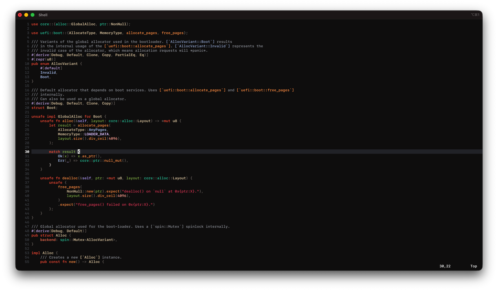
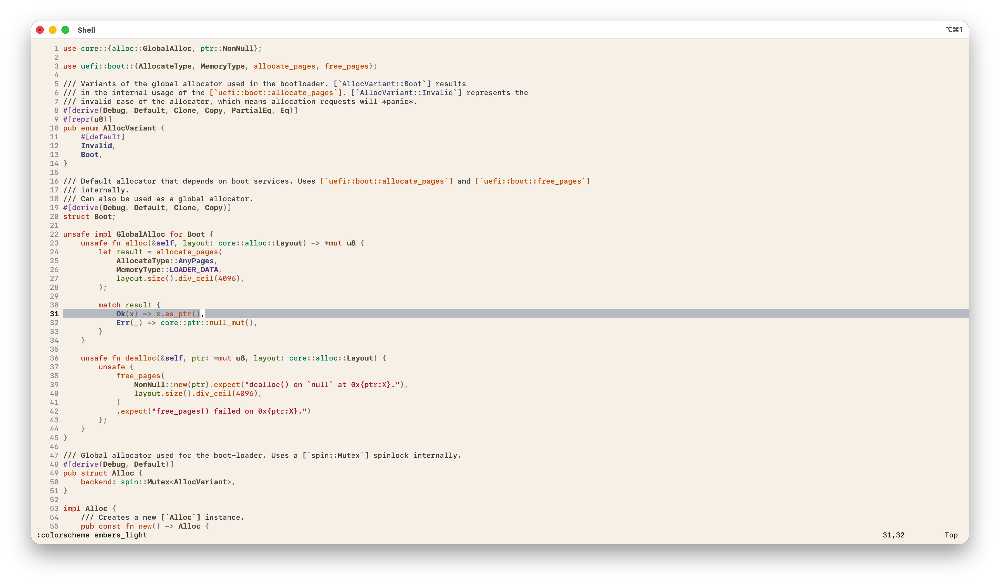

# embers.nvim

A warm, high-contrast Neovim colorscheme with dark (`embers`) and light
(`embers_light`) variants, built on top of Neovim's built-in `habamax` and
`default` base schemes with custom treesitter and LSP semantic highlighting.

## Screenshots





## Installation

### [lazy.nvim](https://github.com/folke/lazy.nvim)

```lua
{ "EralpCelebi/embers.nvim", priority = 1000 }
```

### [packer.nvim](https://github.com/wbthomason/packer.nvim)

```lua
use "EralpCelebi/embers.nvim"
```

### [vim-plug](https://github.com/junegunn/vim-plug)

```vim
Plug 'EralpCelebi/embers.nvim'
```

## Usage

```vim
colorscheme embers
```

or for the light variant:

```vim
colorscheme embers_light
```

In Lua:

```lua
vim.cmd.colorscheme("embers")
-- or
vim.cmd.colorscheme("embers_light")
```

## License

[MIT](./LICENSE)
